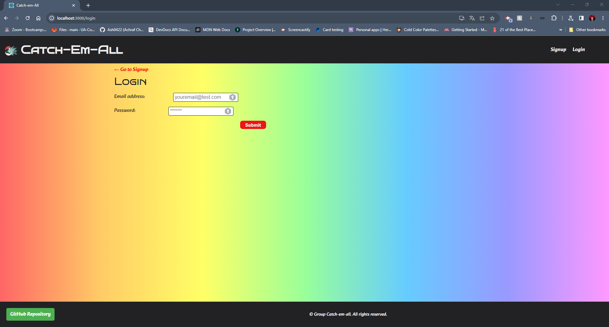

# Catch-Em-All


## Table of Contents

- [Description](#description)
- [Screenshots](#screenshots)
- [Installation](#installation)
- [Usage and DEMO](#usage-and-demogit)
- [User Story](#user-story)
- [Acceptance Criteria](#acceptance-criteria)
- [Contributing](#contributing)
- [Tests](#tests)
- [Credits](#credits)
- [Questions](#questions)

## Description

The Pokemon Adoption Center is a virtual space where users can browse and adopt various types of Pokemon. 
It is an online platform that allows users to view different Pokemon types, read descriptions of each Pokemon's characteristics, 
and ultimately adopt their favorite Pokemon for their own collection. 
The Adoption Center may include various features such as filtering options for specific Pokemon types, sorting options based on various criteria,
and a shopping cart for users to keep track of their selected Pokemon. The main goal of the Pokemon Adoption Center is to provide users with a fun and engaging experience while offering a diverse selection of Pokemon for adoption.

## Screenshots
## Folder Structure <br>


## Screenshot of the Pokemon Adoption Center:


## The following image shows  the Sign Up Page:


## The following image shows the Sign In Page : 


## The following image shows The Logged In Cart :  


## The following image shows the Payment Page : 


## The following image shows the Succeed Payment Page : 


## The following image shows the Adoption History Page : 


## Installation
you can : 
check our Website on this link:   [Catch-Em-All Website](https://catchenall.herokuapp.com/)

## Usage

- 1- User visits the website and browses through available Pokemon by type (e.g. water, fire, grass).
- 2- User selects a Pokemon they want to adopt and adds it to their cart.
- 3- User proceeds to checkout and enters their personal and payment information.
- 4- Once the adoption is confirmed, the user receives a success massage for the payment and the Pokemon is marked as adopted in the center's database.
- 5- User can view their adoption history on the website.
- 6- The Pokemon Adoption Center updates their inventory and sends the adopted Pokemon to their new home.


## User Story
```
AS an Adopter,
I WANT to be able to add Pokemon to my cart and checkout,
SO THAT I can finalize the adoption process.

AS an Administrator of the Adoption Center,
I WANT to be able to add new Pokemon to the database and manage the inventory,
SO THAT there are always new and exciting options available for potential adopters.

AS a registered user of the Adoption Center,
I WANT to be able to view my adoption history and track the status of any pending adoptions,
SO THAT I can stay up-to-date on my collection and adoption progress.
```
## Acceptance Criteria
```
As a user of the Pokemon Adoption Center web application, 
I want to be able to browse through available Pokemon, view their details, 
and add them to my cart for adoption. 
I also want to be able to checkout and pay for the adoption fees securely. 
The website should be easy to navigate and responsive on different devices.
```
## Contributing

Pull requests are welcome, please open an issue first to discuss what you would like to change. thank you

## Tests
The Pokemon Adoption Center has been tested by the creators and it works fine.<br>
this application has been uploaded to github:  [Catch-Em-All GitHub](https://github.com/Angel24e/Catch-em-all)<br>
this application has been deployed to Heroku:  [Catch-Em-All Heroku](https://catchenall.herokuapp.com/)

## Credits
- [Achraf Chibane](https://github.com/Ash0422)
- [Jodie Odette Ruiz](https://github.com/Honey8131)
- [Angel Escamilla](https://github.com/Angel24e)
- [Alex Sanchez](https://github.com/TacoCodes)
- [Savony Panton](https://github.com/Savonyp)

## Questions
For any additional questions, please contact me by [Achraf's EMAIL](chibane.tkd04@gmail.com) . or visit my GitHub profile at [Achraf's GITHUB](https://github.com/Ash0422) .